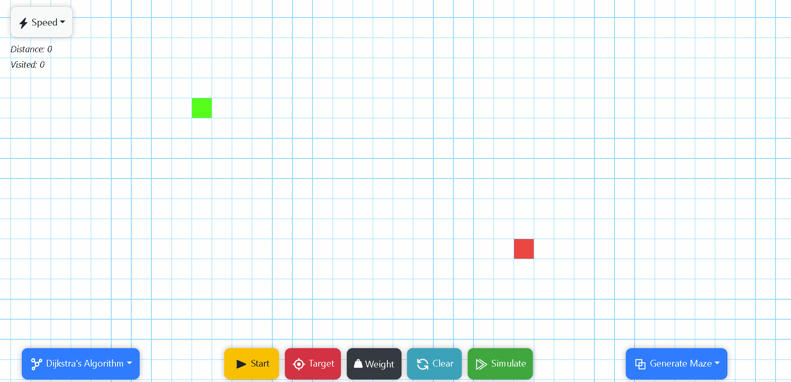
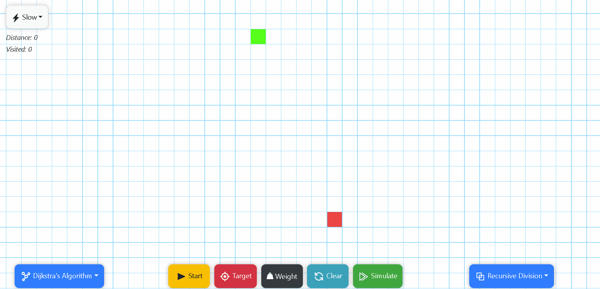
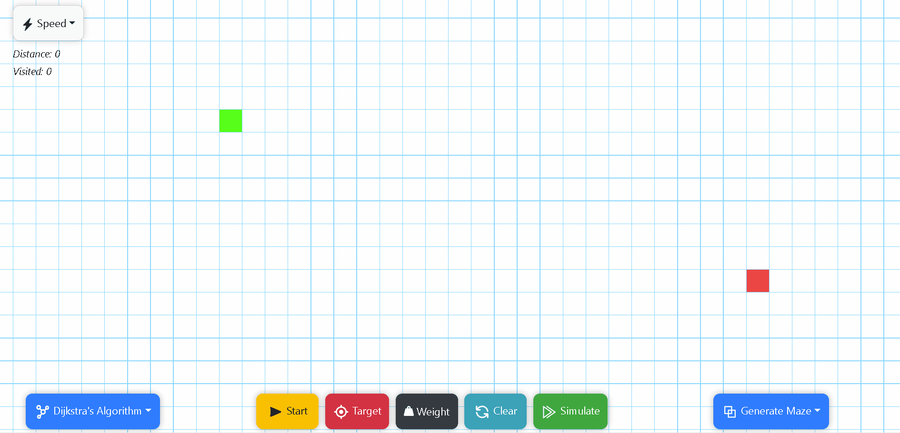
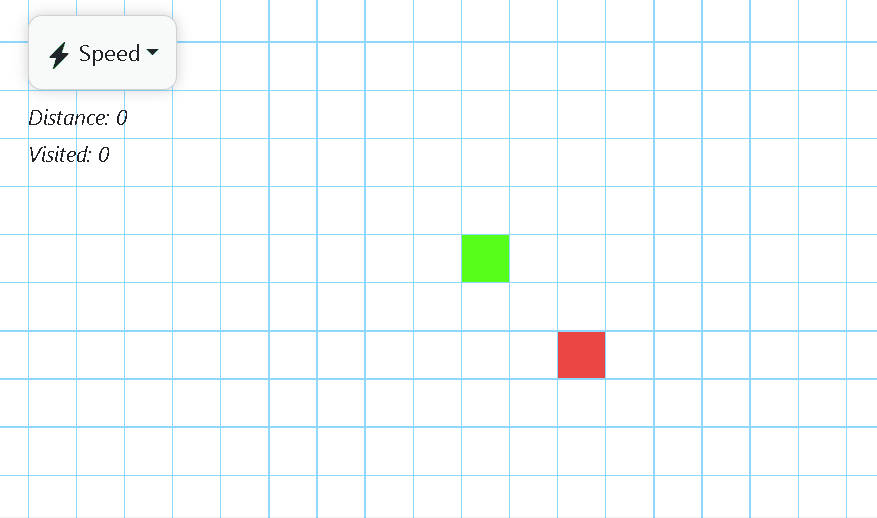
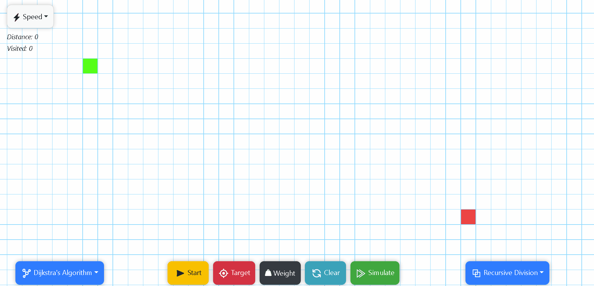

# Pathfinder Visualizer using React JS

One of my earliest personal ReactJS project, this is a pathfinder and graph traversal visualizer to find the shortest path between any two points.

**You can check out the app here** : https://mohdzish.github.io/React-JS-Pathfinder-Visualizer/

There are tons of different pathfinding algorithms out there, but for this project, I have implemented these non-weighted algorithms:
- Dijkstra's algorithm : https://en.wikipedia.org/wiki/Dijkstra%27s_algorithm
- A* search algorithm : https://en.wikipedia.org/wiki/A*_search_algorithm
- Recursive Maze generation algorithm : https://en.wikipedia.org/wiki/Maze_generation_algorithm

## Basic Dijkstra's Visualizer:

This is a simple visualization of of my implementation of Djikstra's algorithm.
As you can see, I've also added a feature to add "walls" that forces the algorithm to search pathways. The Dijkstra algorithm is probably one of the oldest pathfinding algorithm, so it was actually really cool to understand and implement this algorithm, despite numerous challenges, especially in performance.

## Recursive Maze Generation:

Pathfinding can be way more fun if it has a challenging maze to traverse through. So I've added a way to generate a maze recursively. Another similar function is to be able to generate a random maze. There are plenty of different maze generation algorithms, but recursive looked the most interesting to me, and also provided me an oppurtunity to actually work with interesting recursive methods. On the other hand, the random maze is just random so was very simple to implement.

## A* Search Visualizer:

This algorithm is way faster than Dijkstra, and is way more effecient and optimal. This has a very goal-directed heuristic which has some inconveniences, but for most scenarios this algorithm is amazingly good. As you can observe, it only searched along the path towards the goal, and doesn't rotate around it's origin like Dijkstra's.

## Implementing Speed of traversal:

I had the idea that it would be way cooler to work with (in order to understand the algorithms) as well as visualize these algorithms through different speed of traversals. So before even adding the algorithms, I added the ability to control speed in the UI. here you can see how Dijkstra searches it goals (rather blindly...)

## Traversing through a Maze:

And for the final visualization, I tested my code to check if it works under the constraints of a maze, and as you can see it was pretty succesful. Here I used the Dijkstra's algorithm, so it was rather slow, but it an also be done using the A*, which would have been more faster.

## Wrapping up:

This project helped me learn a lot of new things in ReactJS. Right after hitting the tutorials, I started working on this project, and I think overall working on ReactJS had both pros and cons, especially for this project. I wanted to learn how to create and use components, so each grid cells are actually a cell component, and other necessary components were created as well. 

I had to use useState for managing the state of each cell in this grid, which was a daunting task in reagrds to performance. A lot of optimisation were made to improve the speed of calculations. I feel the UI would have been way easier if done using just JS, but at least it was a wonderful oppurtunity to learn to practice and optimize ReactJS.

Feel free to use any of this code (at your own risks) and if you have any questions, you can contact me at mohdzish2000@gmail.com
